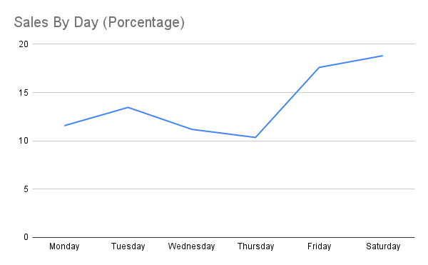
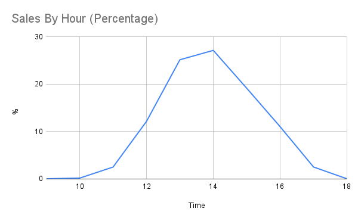
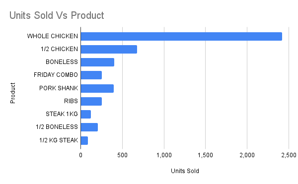

# 🍗 Pollo Listo Sales Analysis

---

## 📌 TL;DR

- 🍗 50% of revenue comes from whole chicken  
- 📅 Weekends drive the highest demand  
- 🧾 Highest average ticket on Sundays  
- ⚠️ Thursday is the weakest day  
- 🍽️ Key combos: chicken + cold pasta, meat + guacamole  

---

## 📊 Description

Sales analysis of a food business using POS data to identify consumption patterns, key products, and business opportunities.

---

## 🎯 Objective

To extract actionable insights that help improve sales performance, optimize operations, and better understand customer behavior.

---

## 🗂️ Dataset

The dataset comes from a POS system and includes:

- sales ID  
- date and time  
- product  
- quantity  
- revenue  

---

## 📈 Key Analysis

### 📊 KPIs

- Total revenue: $950,173  
- Total tickets: 4,753  
- Average ticket: $199  

---

### 📅 Daily Performance

- Best day (excluding opening): 2025-12-21 ($15,956)  
- Worst day: 2026-02-11 ($2,504)  

Insight: High variability in daily sales performance.

---

### 📅 Weekly Behavior

- Saturday: 18.81%  
- Thursday: 10.35%  

Insight: Strong dependency on weekend sales, with Thursday consistently underperforming.

---

### 🧾 Customer Spending

- Highest on Sunday (~$209)  
- Lowest on Thursday (~$193)  

Insight: Customers tend to spend more during weekends.

---

### 🍗 Product Performance

- Whole chicken generates over 50% of total revenue  

Insight: High reliance on a single product.

---

### 📊 Pareto Analysis

- Top 3 products account for 66% of total revenue  

Insight: Revenue is highly concentrated among a few key items.

---

### 🍽️ Product Combinations

- Chicken → cold pasta  
- Meat → guacamole  

Insight: Clear and consistent pairing patterns across product categories.

---

## 💡 Key Insights

- Strong dependency on a single product (whole chicken ~50%)  
- Weekend-driven revenue model  
- Higher customer spending during weekends  
- Clear opportunity to improve Thursday performance  
- Defined product pairing behavior  

---
## 📊 Visual Insights

### 📈 Sales by Day

### ⏰ Sales by Hour

### 🍗 Top Products

## 📊 Dashboard

(https://datastudio.google.com/reporting/b88bfb6c-4bdf-4d50-947a-a791af1a3595)

## 🚀 Business Recommendations

- Create combo meals based on real purchase behavior  
- Launch targeted promotions to boost Thursday sales  
- Optimize inventory for high-performing products  
- Adjust staffing based on peak demand patterns  

---

## 🛠️ Tools

- SQL (BigQuery)
